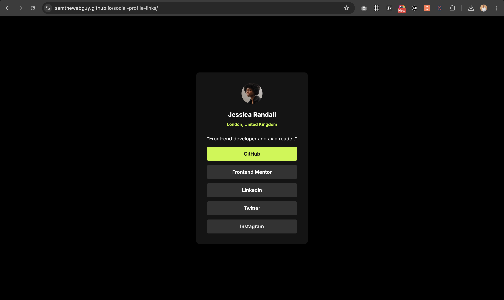

# Frontend Mentor - Social links profile solution

This is a solution to the [Social links profile challenge on Frontend Mentor](https://www.frontendmentor.io/challenges/social-links-profile-UG32l9m6dQ). Frontend Mentor challenges help you improve your coding skills by building realistic projects. 

## Table of contents

- [Overview](#overview)
  - [The challenge](#the-challenge)
  - [Screenshot](#screenshot)
  - [Links](#links)
- [My process](#my-process)
  - [Built with](#built-with)
  - [What I learned](#what-i-learned)
- [Author](#author)


## Overview

### The challenge

Users should be able to:

- View the optimal layout depending on their device’s screen size
- See hover and focus states for all interactive elements

### Screenshot




### Links

- Live Site URL: [View Live Site](https://samthewebguy.github.io/social-profile-links/)

## My process

### Built with

- Semantic HTML5 markup
- CSS custom properties
- Flexbox
- Mobile-first workflow


### What I learned

While working on this project, I learned how to:

- Use Flexbox effectively to center and align elements vertically and horizontally
- Apply CSS hover and focus states to make buttons more interactive
- Structure clean, semantic HTML for better accessibility
- Use mobile-first design principles for a responsive layout.

Here’s a quick example of my code:

```html
    <link rel="icon" href="./Images/favicon-32x32.png" type="image/png">
```
```css
.socialbtn{
    display: flex;
    flex-direction: column;
    text-align: center;
    gap: 12px;
}

.socialbtn a{
    text-decoration: none;
    background-color: #333333;
    color: #fff;
    padding: 12px 24px;
    font-size: 14px;
    font-weight: 600;
    border-radius: 5px;
    line-height: 1.5;
}

.socialbtn a:hover{
    background-color: hsl(75, 94%, 57%);
    color: hsl(0, 0%, 8%);
    transition: background-color 0.3s ease-in-out;
}
```

## Author

- Website - [SAMTHEWEBGUY](https://github.com/samthewebguy)
- Frontend Mentor - [@samthewebguy](https://www.frontendmentor.io/profile/samthewebguy)
- Twitter - [@technioo](https://www.twitter.com/technioo)
